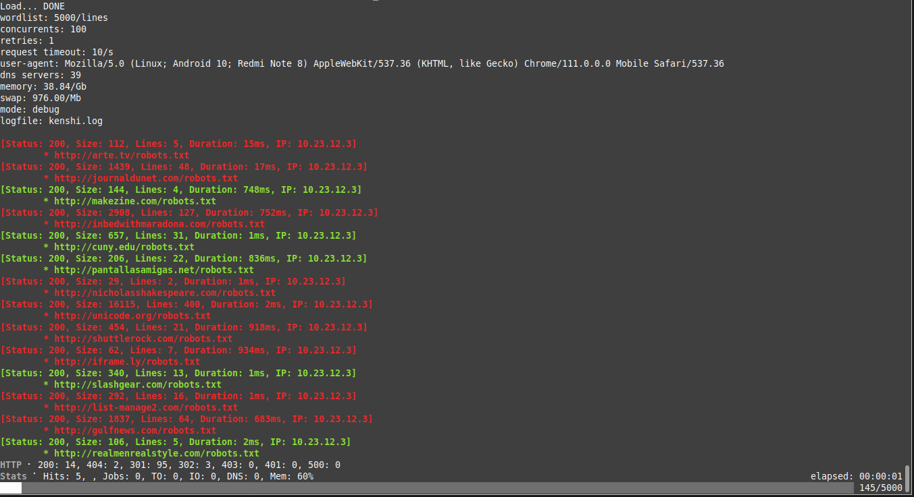

# kenshi

A tool that focuses on medium-sized scans, same as [ffuf](https://github.com/ffuf/ffuf) but also different.
It is currently in its infancy



## The following has now been done

- [x] Performance testing
- [x] Bulk URL loading tests
- [x] socks5/http/https proxy support
- [x] Reduced DNS resolution failures
- [x] And...

## Notes on usage

We need to care about the meaning of the following parameters

- Debug mode: used to get detailed parameters of the target, to decide on optimization parameters, and to debug network errors (similar to ffuf's scanning results).
    - Parameter --debug
- detail mode: get detailed scanning status, with progress bar and HTTP/IO related status display.
    - Parameter --stats
- Silent mode: only need results and speed, don't care about everything.
    - Parameters --silent

# performance test
Additions...

# Install kenshi

```sh
# Cargo required.
cargo install --git https://github.com/AM8bit/kenshi
```

# Build

1. Installing  Rust 

```sh
curl --proto '=https' --tlsv1.2 -sSf https://sh.rustup.rs | sh
```

3.  Get source code

```sh
git clone https://github.com/AM8bit/kenshi.git
cd kenshi
make
./kenshi --help
```

### Usage

The definition of [ffuf](https://github.com/ffuf/ffuf) has been adopted for some of the parameters and descriptions

`kenshi -h`

```console
Usage: ./kenshi [options]

Options:
    -u, --url URL       required. Test url
    -w, --wordlist FILE required. fuzz wordlist
    -o, --output FILE   Output result
        --mr regexp     Match regexp
        --ms length     Match HTTP response size
        --ml int        Match amount of lines in response
        --mt            Match how many milliseconds to the first response
                        byte, either greater or less than. EG: >100 or <100
        --mc            Match HTTP status codes, or "all" for everything.
                        (default: 200,204,301,302,307,401,403,405,500)
        --fc regexp     Filter HTTP status codes from response. Comma
                        separated list of codes and ranges
        --fl            Filter by amount of lines in response. Comma separated
                        list of line counts and ranges
        --fmode         Filter set operator. Either of: and, or (default: or)
        --fr            Filter regexp
        --fs            Filter HTTP response size. Comma separated list of
                        sizes and ranges
        --rt Int        request timeout
    -c, --parallel 1000 Number of parallel requests
    -r, --retrie 1      Number of failed retry requests
    -p, --proxy socks5://1.1.1.1:1080
                        proxy request, http/https/socks5
    -U, --auth username:password
                        proxy auth, if required
        --clear         cache Clear
        --debug         More detailed logging mode
        --silent        silent mode
    -v, --stats         Display detailed scanning status
        --dns-list Url or File
                        Specify a list of name servers
    -h, --help          print this help menu

```
#### Match page string
kenshi -u https://FUZZ/robots.txt -w fuzz.dict --mr test_str


# License

kenshi is distributed under MIT License
